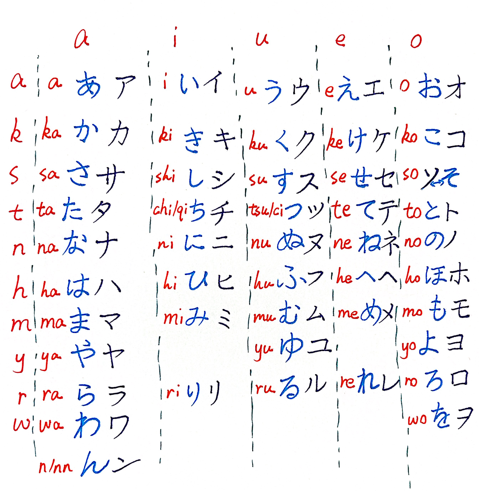

# 五十音（ごじゅうおん）

## 清音（せいおん）

<table>
  <tr>
    <th></th>
    <th>あ段（あだん）</th>
    <th>い段</th>
    <th>う段</th>
    <th>え段</th>
    <th>お段</th>
  </tr>

  <tr>
    <th class="section-header">あ行（あぎょう）</th>
    <td>
あ/ア

a
</td>
    <td>
い/イ

i
</td>
    <td>
う/ウ

u
</td>
    <td>
え/エ

e
</td>
    <td>
お/オ

o
</td>
  </tr>

  <tr>
    <th class="section-header">か行</th>
    <td>
か/カ

ka
</td>
    <td>
き/キ

ki
</td>
    <td>
く/ク

ku
</td>
    <td>
け/ケ

ke
</td>
    <td>
こ/コ

ko
</td>
  </tr>

  <tr>
    <th class="section-header">さ行</th>
    <td>
さ/サ

sa
</td>
    <td>
し/シ

shi
</td>
    <td>
す/ス

su
</td>
    <td>
せ/セ

se
</td>
    <td>
そ/ソ

so
</td>
  </tr>

  <tr>
    <th class="section-header">た行</th>
    <td>
た/タ

ta
</td>
    <td>
ち/チ

chi
</td>
    <td>
つ/ツ

tsu
</td>
    <td>
て/テ

te
</td>
    <td>
と/ト

to
</td>
  </tr>

  <tr>
    <th class="section-header">な行</th>
    <td>
な/ナ

na
</td>
    <td>
に/ニ

ni
</td>
    <td>
ぬ/ヌ

nu
</td>
    <td>
ね/ネ

ne
</td>
    <td>
の/ノ

no
</td>
  </tr>

  <tr>
    <th class="section-header">は行</th>
    <td>
は/ハ

ha
</td>
    <td>
ひ/ヒ

hi
</td>
    <td>
ふ/フ

fu
</td>
    <td>
へ/ヘ

he
</td>
    <td>
ほ/ホ

ho
</td>
  </tr>

  <tr>
    <th class="section-header">ま行</th>
    <td>
ま/マ

ma
</td>
    <td>
み/ミ

mi
</td>
    <td>
む/ム

mu
</td>
    <td>
め/メ

me
</td>
    <td>
も/モ

mo
</td>
  </tr>

  <tr>
    <th class="section-header">や行</th>
    <td>
や/ヤ

ya
</td>
    <td style="background:#f9f9f9"></td>
    <td>
ゆ/ユ

yu
</td>
    <td style="background:#f9f9f9"></td>
    <td>
よ/ヨ

yo
</td>
  </tr>

  <tr>
    <th class="section-header">ら行</th>
    <td>
ら/ラ

ra
</td>
    <td>
り/リ

ri
</td>
    <td>
る/ル

ru
</td>
    <td>
れ/レ

re
</td>
    <td>
ろ/ロ

ro
</td>
  </tr>

  <tr>
    <th class="section-header">わ行</th>
    <td>
わ/ワ

wa
</td>
    <td colspan="3" style="background:#f9f9f9"></td>
    <td>
を/ヲ

wo
</td>
  </tr>

  <tr>
    <th class="section-header">特殊（とくしゅ）</th>
    <td colspan="5">
ん/ン

nn
</td>
  </tr>
</table>

### 清音（せいおん））の手書き体（てがきたい）

## 濁音と半濁音（だくおん・はんだくおん）

<table>
  <tr>
    <th>段</th>
    <th>あ段</th>
    <th>い段</th>
    <th>う段</th>
    <th>え段</th>
    <th>お段</th>
  </tr>

  <!-- k 行 -->
  <tr>
    <th class="section-header">か行 清音</th>
    <td>
か/カ

ka
</td>
    <td>
き/キ

ki
</td>
    <td>
く/ク

ku
</td>
    <td>
け/ケ

ke
</td>
    <td>
こ/コ

ko
</td>
  </tr>
  <tr>
    <th class="section-header">が行 浊音（だくおん）</th>
    <td>
が/ガ

ga
</td>
    <td>
ぎ/ギ

gi
</td>
    <td>
ぐ/グ

gu
</td>
    <td>
げ/ゲ

ge
</td>
    <td>
ご/ゴ

go
</td>
  </tr>

  <!-- s 行 -->
  <tr>
    <th class="section-header">さ行 清音</th>
    <td>
さ/サ

sa
</td>
    <td>
し/シ

shi
</td>
    <td>
す/ス

su
</td>
    <td>
せ/セ

se
</td>
    <td>
そ/ソ

so
</td>
  </tr>
  <tr>
    <th class="section-header">ざ行 浊音（だくおん）</th>
    <td>
ざ/ザ

za
</td>
    <td>
じ/ジ

ji
</td>
    <td>
ず/ズ

zu
</td>
    <td>
ぜ/ゼ

ze
</td>
    <td>
ぞ/ゾ

zo
</td>
  </tr>

  <!-- t 行 -->
  <tr>
    <th class="section-header">た行 清音</th>
    <td>
た/タ

ta
</td>
    <td>
ち/チ

chi
</td>
    <td>
つ/ツ

tsu
</td>
    <td>
て/テ

te
</td>
    <td>
と/ト

to
</td>
  </tr>
  <tr>
    <th class="section-header">だ行 浊音（だくおん）</th>
    <td>
だ/ダ

da
</td>
    <td>
ぢ/ヂ

ji
</td>
    <td>
づ/ヅ

zu
</td>
    <td>
で/デ

de
</td>
    <td>
ど/ド

do
</td>
  </tr>

  <!-- h 行 -->
  <tr>
    <th class="section-header">は行 清音</th>
    <td>
は/ハ

ha
</td>
    <td>
ひ/ヒ

hi
</td>
    <td>
ふ/フ

fu
</td>
    <td>
へ/ヘ

he
</td>
    <td>
ほ/ホ

ho
</td>
  </tr>
  <tr>
    <th class="section-header">ば行 浊音（だくおん）</th>
    <td>
ば/バ

ba
</td>
    <td>
び/ビ

bi
</td>
    <td>
ぶ/ブ

bu
</td>
    <td>
べ/ベ

be
</td>
    <td>
ぼ/ボ

bo
</td>
  </tr>
  <tr>
    <th class="section-header">ぱ行 半浊音（はんだくおん）</th>
    <td>
ぱ/パ

pa
</td>
    <td>
ぴ/ピ

pi
</td>
    <td>
ぷ/プ

pu
</td>
    <td>
ぺ/ペ

pe
</td>
    <td>
ぽ/ポ

po
</td>
  </tr>
</table>

### 濁音と半濁音（だくおん・はんだくおん）の手書き体（てがきたい）